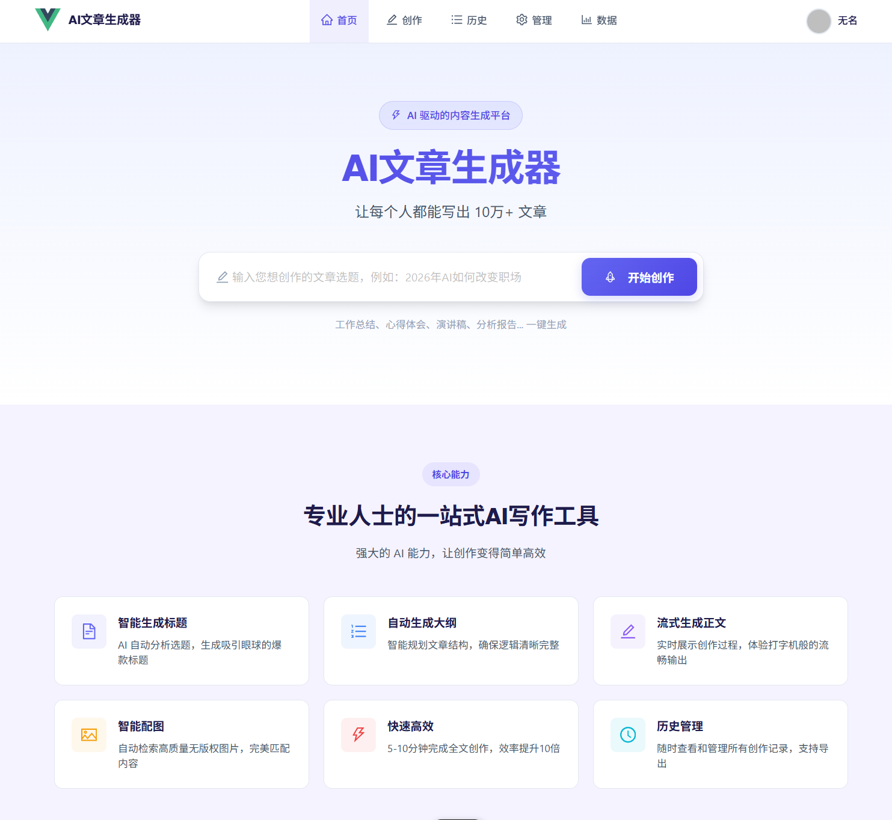
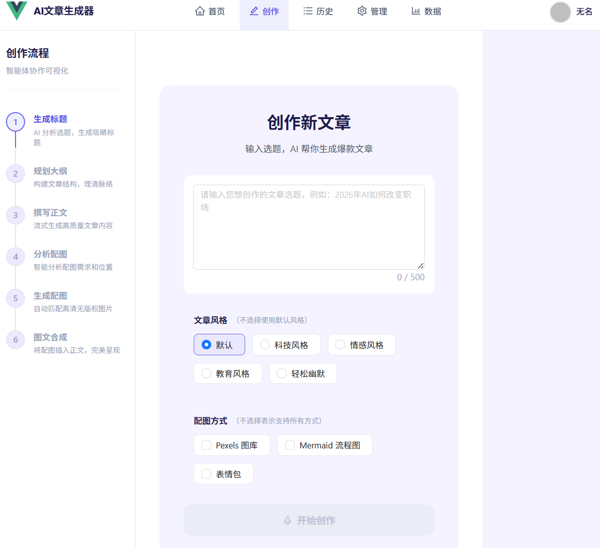
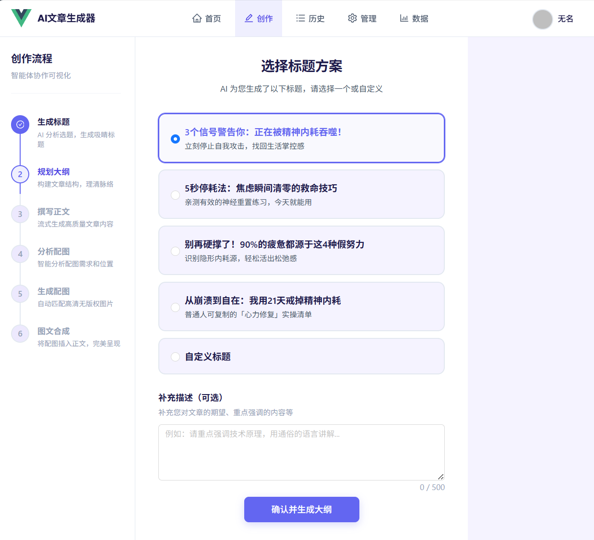
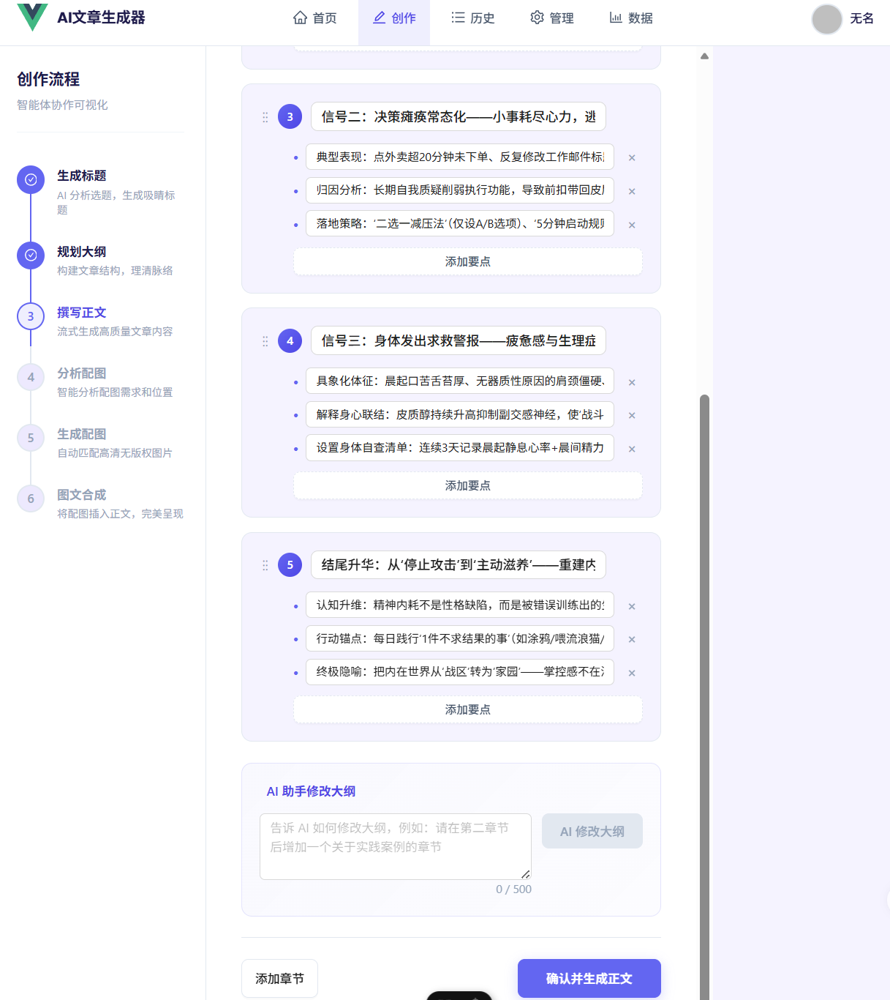
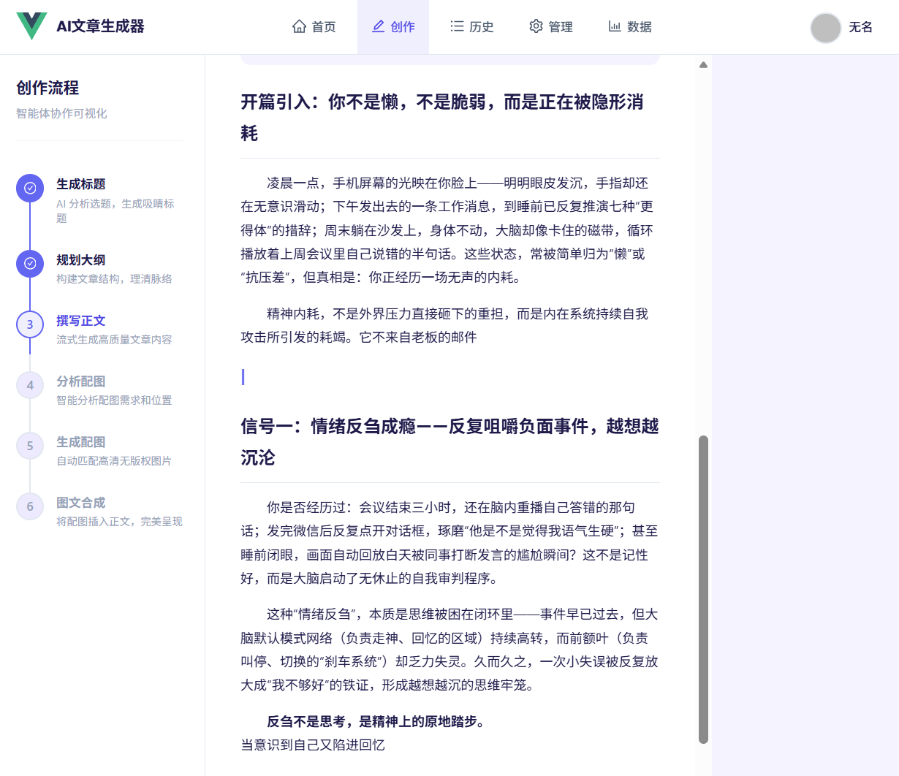
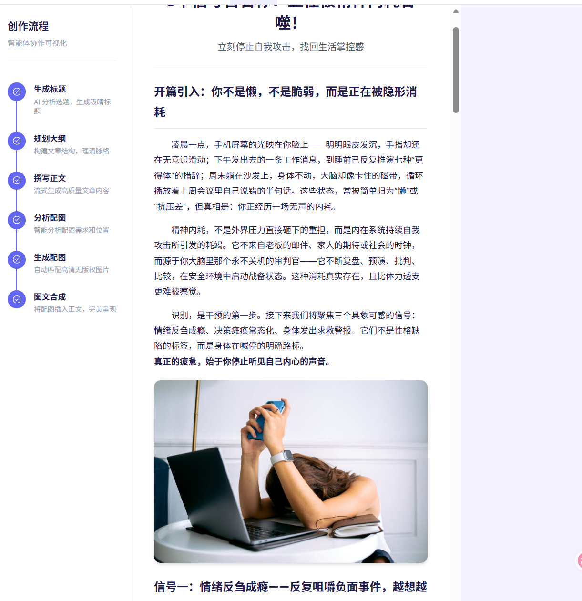
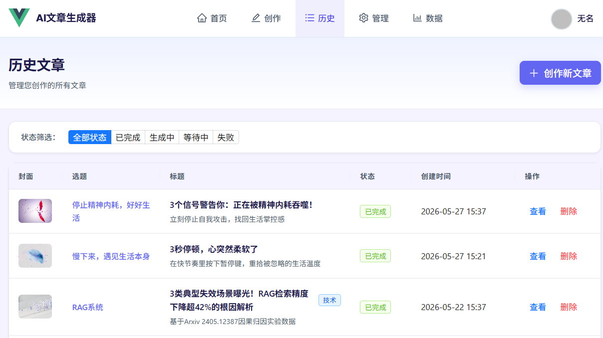
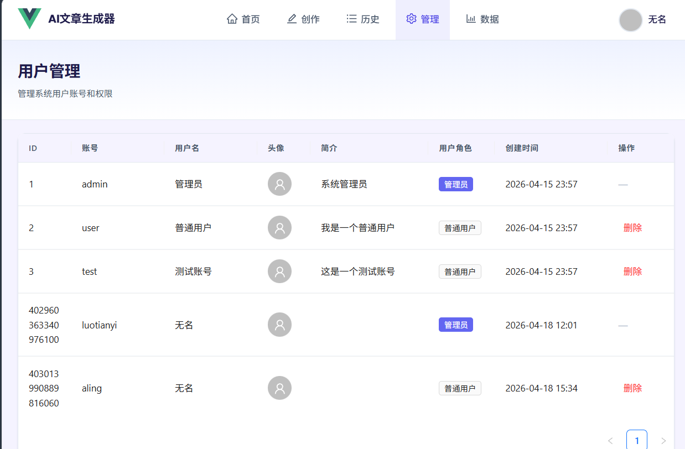

# AI Passage — AI 智能图文创作平台

基于 **Spring Boot 3 + Spring AI Alibaba** 的多智能体协作图文创作平台。用户输入选题后，由 5 个 AI Agent 自动完成「标题生成 → 大纲设计 → 正文创作 → 配图分析 → 图文合并」的完整创作流程，支持 SSE 流式实时输出，让用户全程可见 AI 的创作过程。

## 项目预览

### 首页

<!-- 截图：首页整体界面，展示导航栏、Banner、功能入口等 -->


### 文章创作 — 输入选题

<!-- 截图：文章创建页面，展示选题输入框、风格选择、配图方式勾选等 -->


### 阶段一：AI 生成标题方案

<!-- 截图：标题生成完成后的界面，展示 3-5 个标题选项（含主标题+副标题），用户可选择一个 -->


### 阶段二：AI 生成大纲 + 用户编辑

<!-- 截图：大纲编辑界面，左侧展示 AI 生成的文章大纲（章节+要点），右侧支持手动编辑或输入修改建议让 AI 辅助修改 -->


### 阶段三：正文创作 + 实时流式输出

<!-- 截图：正文生成界面，展示 SSE 实时流式输出的 Markdown 内容，右侧或底部显示 AI 的思考过程/日志 -->


### 配图生成

<!-- 截图：配图生成过程界面，展示各章节配图的生成进度，可看到不同来源（Pexels、Mermaid 图表、AI 生图等）的并行生成状态 -->


### 文章详情 — 图文合并最终效果

<!-- 截图：文章详情页，展示图文合并后的完整文章，包含封面图、正文配图、Mermaid 图表、Emoji 装饰等 -->


### 文章管理列表

<!-- 截图：文章列表页，展示分页列表、状态筛选（待处理/生成中/已完成/失败）、操作按钮等 -->


### 管理后台 — 用户管理

<!-- 截图：管理员用户管理页面，展示用户列表、角色管理、分页等 -->


---

## 系统架构

<!-- 截图：系统架构图，展示 Vue3 前端 → Spring Boot 后端 → StateGraph 多智能体 → AI DashScope，以及 Redis/MySQL/COS 等基础设施 -->


### 多智能体流水线

```
用户输入选题
    │
    ▼
┌──────────────────────┐
│  Agent 1: 标题生成    │  → 生成 3-5 个标题方案供用户选择
└──────────────────────┘
    │ 用户选择标题
    ▼
┌──────────────────────┐
│  Agent 2: 大纲生成    │  → 流式生成文章大纲（章节+要点）
└──────────────────────┘
    │ 用户确认/修改大纲
    ▼
┌──────────────────────┐
│  Agent 3: 正文创作    │  → 流式生成文章正文（含配图占位符）
└──────────────────────┘
    │
    ▼
┌──────────────────────┐
│  Agent 4: 配图分析    │  → 分析正文内容，生成配图需求列表
└──────────────────────┘
    │
    ▼
┌──────────────────────┐
│  Agent 5: 图文合并    │  → 并行生成配图 + 替换占位符合并全文
└──────────────────────┘
    │
    ▼
  完整文章（图文并茂）
```

## 技术亮点

- **StateGraph 多智能体编排**：使用 Spring AI Alibaba StateGraph 构建工作流，通过 `ReplaceStrategy` 管理状态流转，实现 Agent 串行与并行协同
- **SSE 流式输出**：基于 Server-Sent Events 实现文章生成全过程的实时推送，用户可实时看到 AI 创作内容
- **ThreadLocal SSE 透传**：通过 `StreamHandlerContext` 将 SSE 处理器透传至 Agent 内部，避免序列化问题
- **策略模式图片服务**：统一封装 Pexels 图库、Nano Banana AI 生图、Mermaid 图表、SVG 图表、Iconify 图标、Emoji 表情包等 6 种图片来源，支持自动降级
- **Redis + MySQL 两级缓存**：L1 Redis（3 天 TTL）+ L2 MySQL 持久化，细粒度缓存键去重，命中次数异步更新
- **并行配图生成**：基于 CompletableFuture 按图片类型分组并行执行，CopyOnWriteArrayList 保证线程安全
- **AOP 可观测性**：`@AgentExecution` 注解 + 环绕切面自动记录每个 Agent 的执行耗时、输入输出、成功/失败状态
- **声明式权限校验**：`@AuthCheck` 注解 + AOP 实现角色级别接口权限控制

## 技术栈

| 层级 | 技术 |
|------|------|
| 后端框架 | Spring Boot 3、Java 21 |
| AI 编排 | Spring AI Alibaba StateGraph |
| ORM | MyBatis-Flex |
| 数据库 | MySQL 8.0 |
| 缓存 | Redis |
| 对象存储 | 腾讯云 COS |
| AI 模型 | 阿里 DashScope（Qwen） |
| 前端 | Vue 3 + TypeScript + Vite |
| UI 框架 | Ant Design Vue |
| 状态管理 | Pinia |
| 构建工具 | Vite 8 |

## 项目结构

```
aipassage/
├── src/main/java/com/kanade/aipassage/
│   ├── agent/                     # 多智能体编排
│   │   ├── agents/                # 5 个 Agent 实现
│   │   ├── parallel/              # 并行配图生成
│   │   ├── context/               # ThreadLocal SSE 上下文
│   │   └── ArticleAgentOrchestrator.java  # StateGraph 编排器
│   ├── aop/                       # AOP 切面（Agent 日志 + 权限校验）
│   ├── controller/                # REST API
│   ├── service/                   # 业务逻辑层
│   ├── image/                     # 图片服务（策略模式实现）
│   ├── sse/                       # SSE 连接管理
│   ├── config/                    # 配置类
│   └── model/                     # 数据模型
├── frontend/aiPassage/src/        # Vue3 前端
│   ├── pages/                     # 页面组件
│   │   ├── article/               # 文章创作/列表/详情
│   │   ├── user/                  # 登录/注册
│   │   └── admin/                 # 管理后台
│   ├── components/                # 通用组件
│   ├── router/                    # 路由配置
│   ├── stores/                    # Pinia 状态管理
│   └── api/                       # API 接口封装
└── CLAUDE.md                      # AI 开发指南
```

## 快速开始

### 环境要求

- Java 21
- Maven 3.8+
- Node.js 20+
- MySQL 8.0+
- Redis

### 后端启动

```bash
# 克隆项目
git clone <repo-url>
cd aipassage

# 配置数据库和 Redis（修改 application.yml 或 application-local.yml）

# 启动后端
mvn spring-boot:run -Dspring-boot.run.profiles=local
```

### 前端启动

```bash
cd frontend/aiPassage

# 安装依赖
npm install

# 启动开发服务器（默认代理到 localhost:8341）
npm run dev
```

访问 http://localhost:5173 即可使用。

## 功能清单

- [x] 用户注册 / 登录
- [x] AI 自动生成多个标题方案供选择
- [x] AI 自动生成文章大纲，支持手动编辑 + AI 辅助修改
- [x] SSE 流式输出正文，实时展示 AI 创作过程
- [x] 多来源智能配图（图库检索、AI 生图、Mermaid 图表、SVG、Emoji 等）
- [x] 图文自动合并，占位符替换
- [x] 图片缓存（Redis + MySQL），加速重复查询
- [x] 文章列表、详情查看、删除
- [x] 管理员用户管理
- [x] Agent 执行日志记录与监控
